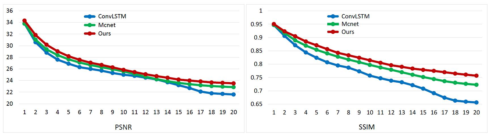
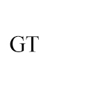
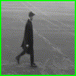
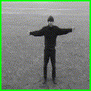
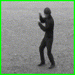
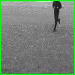
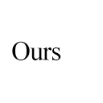

# Deep RNN Framework

This is the code for the paper [Deep RNN Framework for Visual Sequential Applications](https://arxiv.org/abs/1811.09961) by Bo Pang, Kaiwen Zha, Hanwen Cao, and Chen Shi.

Please follow the instructions to run the code.

## Overview

[Deep-RNN Framework](https://github.com/BoPang1996/Deep-RNN-Framework/) is a RNN framework for high-dimensional sequential tasks and in this repository we focus on the visualtasks. The deep-RNN framework achieves **more than 11% relative improvements** over shallow RNN models on Kinetics, UCF-101, and HMDB-51 for **video classification**. For **auxiliary annotation**, after replacing the shallow RNN part of Polygon-RNN with our 15-layer deep RBM, **the performance improves by 14.7%**. For **video future prediction**, our deep RNN improves the state-of-the-art shallow model's performance by **2.4% on PSNR and SSIM**.

## Action Recognition and Anticipation

### Results

Results on backbone supported models:

|                   | UCF-101     |              | HMDB-51     |              |
| ----------------- | ----------- | ------------ | ----------- | ------------ |
|                   | Recognition | Anticipation | Recognition | Anticipation |
| 1-layer LSTM      | 71.1        | 30.6         | 36.0        | 18.8         |
| 15-layer ConvLSTM | 68.9        | 49.6         | 34.2        | 27.6         |
| 1-layer RBM       | 65.3        | 28.4         | 34.3        | 16.9         |
| **15-layer RBM**  | **79.8**    | **57.7**     | **40.2**    | **32.1**     |

Action recognition results on standalone RNN models:

| Architecture                  | Kinetics | UCF-101 | HMDB-51 |
| ----------------------------- | -------- | ------- | ------- |
| Shallow LSTM with Backbone    | 53.9     | 86.8    | 49.7    |
| C3D                           | 56.1     | 79.9    | 49.4    |
| Two-Stream                    | 62.8     | 93.8    | 64.3    |
| 3D-Fused                      | 62.3     | 91.5    | 66.5    |
| **Deep RBM without Backbone** | 60.2     | 91.9    | 61.7    |

### Usage

#### Model with Backbone

0. Dependencies:

     - Python 2.7
     - Pytorch 0.4
     - torchvision
     - Numpy
     - Pillow
     - tqdm

1. Download [UCF101](http://crcv.ucf.edu/data/UCF101.php) and [HMDB](http://serre-lab.clps.brown.edu/resource/hmdb-a-large-human-motion-database/) and organize the image files (from the videos) as follows:

   ```
   Dataset
   ├── train
   │   ├── action0
   │   │   ├── video0
   |   |   |   ├── frame0
   |   |   |   ├── frame1
   |   |   |   ├── ...
   │   │   ├── video1
   |   |   |   ├── frame0
   |   |   |   ├── frame1
   |   |   |   ├── ...
   │   │   ├── ...
   │   ├── action1
   │   ├── ...
   ├── test
   │   ├── action0
   │   │   ├── video0
   │   │   |     ├── frame0
   │   │   ├── ...
   │   ├── ...
   ```

2. Running train.py and test.py for training and evaluation respectively. By default, the code runs for action recognition and you can assign "--anticipation" for action anticipation:

   ```
   # for action recognition
   python train.py
   python test.py
   
   # for action anticipation
   python train.py --anticipation
   python test.py --anticipation
   ```

3. Get our pre-trained models: 
   - Action Recognition on UCF-101: [Google Drive](https://drive.google.com/open?id=1VwLjA0pNyPrSBtbbW_XwtYl6tYtBQwkT), [Baidu Pan](https://pan.baidu.com/s/1tqcZ9t38Cif8baHAVeGibw)
   - Action Anticipation on UCF-101: [Google Drive](https://drive.google.com/open?id=1AiSrdfB23h_vkxjqhGpO5ATXNqhempC-), [Baidu Pan](https://pan.baidu.com/s/1Het_IiZpJMA7sProYUZGSA)
   - Action Recognition on HMDB-51: [Google Drive](https://drive.google.com/open?id=1qYHFtCbxPiQXgOdOTFKO-hLMUlmFxa9y), [Baidu Pan](https://pan.baidu.com/s/1FJVM-nMmKfWX9q6v75NPPw)
   - Action Anticipation on HMDB-51: [Google Drive](https://drive.google.com/open?id=1Nm3iomj-rpMuxqCSl9RwxoVM52E05Ehi), [Baidu Pan](https://pan.baidu.com/s/1nXcno-MapGw-bmvxCPMjCQ)

#### Standalone model without backbone

0. Dependencies:

      - Python 2.7
      - Pytorch 0.4
      - torchvision
      - Numpy
      - Pillow
      - tqdm

1. Download Kinetics-400 from the [official website](https://deepmind.com/research/open-source/open-source-datasets/kinetics/) or from the copy of [facebookresearch/video-nonlocal-net](https://github.com/facebookresearch/video-nonlocal-net/blob/master/DATASET.md), and organize the image files (from the videos) the same as  UCF101 and HMDB:

   ```
   Dataset
   ├── train_frames
   │   ├── action0
   │   │   ├── video0
   |   |   |   ├── frame0
   ├── test_frames
   ```

2. Running train.py and test.py for training and evaluation respectively. In this standalone model, we only commit the action recognition task:

   1. Run the following command to train.

      ```
      # start from scratch
      python main.py --train 
      
      # start from our pre-trained model
      python main.py --model_path [path_to_model] --model_name [model's name] --resume --train
      ```

   2. Run the following command to test.

      ```
      python main.py --test
      ```

   3. Get our pre-trained models: 

      - Action Recognition on Kinetics: [Google Drive](), [Baidu Pan](https://pan.baidu.com/s/1Dvake0_NgpgkyArlA4n_PQ)


## Auxiliary Annotation (Polygon-RNN)

### Results

Results on Cityscapes dataset:

| Model                                      |               |                      | IoU      |
| ------------------------------------------ | ------------- | -------------------- | -------- |
| Original Polygon-RNN                       |               |                      | 61.4     |
| Residual Polygon-RNN                       |               |                      | 62.2     |
| Residual Polygon-RNN + attention + RL      |               |                      | 67.2     |
| Residual Polygon-RNN + attention + RL + EN |               |                      | 70.2     |
| Polygon-RNN++                              |               |                      | **71.4** |
|                                            | **\# Layers** | **\# params of RNN** |          |
| Polyg-LSTM                                 | 2             | 0.47M                | 61.4     |
| Polyg-LSTM                                 | 5             | 2.94M                | 63.0     |
| Polyg-LSTM                                 | 10            | 7.07M                | 59.3     |
| Polyg-LSTM                                 | 15            | 15.71M               | 46.7     |
| Polyg-RBM                                  | 2             | 0.20M                | 59.9     |
| Polyg-RBM                                  | 5             | 1.13M                | 63.1     |
| Polyg-RBM                                  | 10            | 2.68M                | 67.1     |
| **Polyg-RBM**                              | 15            | 5.85M                | **70.4** |

### Usage

0. Dependencies:

  - Python 2.7
  - Pytorch 0.4
  - torchvision
  - Numpy
  - Pillow

1. Download data from [Cityscapes](https://www.cityscapes-dataset.com/downloads/), organize the image files and annotation json files as follows:

```
img
├── train
│   ├── cityname1
│   │   ├── pic.png
│   │   ├── ...
│   ├── cityname2
│   │   ├── pic.png
│   │   ├── ...
├── val
│   ├── cityname
│   │   ├── pic.png
│   │   ├── ...
├── test
│   ├── cityname
│   │   ├── pic.png
│   │   ├── ...
```
```
label
├── train
│   ├── cityname1
│   │   ├── annotation.json
│   │   ├── ...
│   ├── cityname2
│   │   ├── annotation.json
│   │   ├── ...
├── val
│   ├── cityname
│   │   ├── annotation.json
│   │   ├── ...
├── test
│   ├── cityname
│   │   ├── annotation.json
│   │   ├── ...
```

The png files and the json files should have corresponding same name.

Execute the following command to make directories for new data and save models:

```
mkdir -p new_img/(train/val/test)
mkdir -p new_label/(train/val/test)
mkdir save
```

2. Run the following command to generate data for train/validation/test.

```
python generate_data.py --data train/val/test
```

3. Run the following command to train.

```
python train.py --gpu_id 0 --batch_size 1  --lr 0.0001 --pretrained False
```

4. Run the following command to test.

```
python test.py --gpu_id 0 --batch_size 128 --model (model_path)
```

## Video Future Prediction

### Results

1. Quantitative results on KTH:

|  Method  | Metric |  T1   |  T2   |  T3   |  T4   |  T5   |  T6   |  T7   |  T8   |  T9   |  T10  |  T11  |  T12  |  T13  |  T14  |  T15  |  T16  |  T17  |  T18  |  T19  |  T20  |    Avg    |
| :------: | :----: | :---: | :---: | :---: | :---: | :---: | :---: | :---: | :---: | :---: | :---: | :---: | :---: | :---: | :---: | :---: | :---: | :---: | :---: | :---: | :---: | :-------: |
| ConvLSTM |  PSNR  | 33.8  | 30.6  | 28.8  | 27.6  | 26.9  | 26.3  | 26.0  | 25.7  | 25.3  | 25.0  | 24.8  | 24.5  | 24.2  | 23.7  | 23.2  | 22.7  | 22.1  | 21.8  | 21.7  | 21.6  |   25.3    |
|          |  SSIM  | 0.947 | 0.906 | 0.871 | 0.844 | 0.824 | 0.807 | 0.795 | 0.787 | 0.773 | 0.757 | 0.747 | 0.738 | 0.732 | 0.721 | 0.708 | 0.691 | 0.674 | 0.663 | 0.659 | 0.656 |   0.765   |
|  MCnet   |  PSNR  | 33.8  | 31.0  | 29.4  | 28.4  | 27.6  | 27.1  | 26.7  | 26.3  | 25.9  | 25.6  | 25.1  | 24.7  | 24.2  | 23.9  | 23.6  | 23.4  | 23.2  | 23.1  | 23.0  | 22.9  |   25.9    |
|          |  SSIM  | 0.947 | 0.917 | 0.889 | 0.869 | 0.854 | 0.840 | 0.828 | 0.817 | 0.808 | 0.797 | 0.788 | 0.799 | 0.770 | 0.760 | 0.752 | 0.744 | 0.736 | 0.730 | 0.726 | 0.723 |   0.804   |
| **Ours** |  PSNR  | 34.3  | 31.8  | 30.2  | 29.0  | 28.2  | 27.6  | 27.14 | 26.7  | 26.3  | 25.8  | 25.5  | 25.1  | 24.8  | 24.5  | 24.2  | 24.0  | 23.8  | 23.7  | 23.6  | 23.5  | **26.5**  |
|          |  SSIM  | 0.951 | 0.923 | 0.905 | 0.885 | 0.871 | 0.856 | 0.843 | 0.833 | 0.824 | 0.814 | 0.805 | 0.796 | 0.790 | 0.783 | 0.779 | 0.775 | 0.770 | 0.765 | 0.761 | 0.757 | **0.824** |



2. Qualitative results on KTH
<div align="center">
    
    
    
    
    
</div>

<div align="center">
    
    
    
    
    
</div>

<div align="center">
    
    
    
    
    
</div>


### Usage

0. Dependencies:
   - Python 2.7
   - Tensorflow 1.1.0 (pip install --ignore-installed --upgrade https://storage.googleapis.com/tensorflow/linux/gpu/tensorflow_gpu-1.1.0-cp27-none-linux_x86_64.whl)
   - Package: scipy, imageio, pyssim, joblib, Pillow, scikit-image, opencv-python (pip or conda)
   - FFMPEG: conda install -c menpo ffmpeg=3.1.3
1. Downloading [KTH](http://www.nada.kth.se/cvap/actions/) dataset

```
./data/KTH/download.sh
```

2. Training (enable balanced multi-gpu training)

```
python train_kth_multigpu.py --gpu 0 1 2 3 4 5 6 7 --batch_size 8 --lr 0.0001
```

3. Testing

```
python test_kth.py --gpu 0 --prefix (checkpoint_folder) --p (checpoint_index)
```


4. Obtain quantitative and qualitative results

The generated gifs will be located in

```
./results/images/KTH
```

The quantitative results will be located in

```
./results/quantitative/KTH
```

The quantitative results for each video will be stored as dictionaries, and the mean results for all test data instances at every timestep can be displayed as

```
import numpy as np
results = np.load('<results_file_name>')
print(results['psnr'].mean(axis=0))
print(results['ssim'].mean(axis=0))
```

## Contributors

Deep RNN framework is authored by [Bo Pang](https://github.com/BoPang1996), [Kaiwen Zha](https://github.com/Sunshine-KaiwenZha), Hanwen Cao, Chen Shi and [Cewu Lu](http://mvig.sjtu.edu.cn/). Note that Cewu Lu is the corresponding author.  

## Acknowledgements

Special thanks for the source code of [MCnet](https://github.com/rubenvillegas/iclr2017mcnet) for ICLR 2017 paper: Decomposing Motion and Content for Natural Video Sequence Prediction.

## Citation

Please cite these papers in your publications if it helps your research:

```
@article{pang2018deeprnn
 title = {Deep RNN Framework for Visual Sequential Applications}，
 author = {Bo, Pang and Kaiwen, Zha and Hanwen, Cao and Chen, Shi, and Cewu, Lu},
 journal = {arXiv preprint}
 year = {2018}
 }
```

